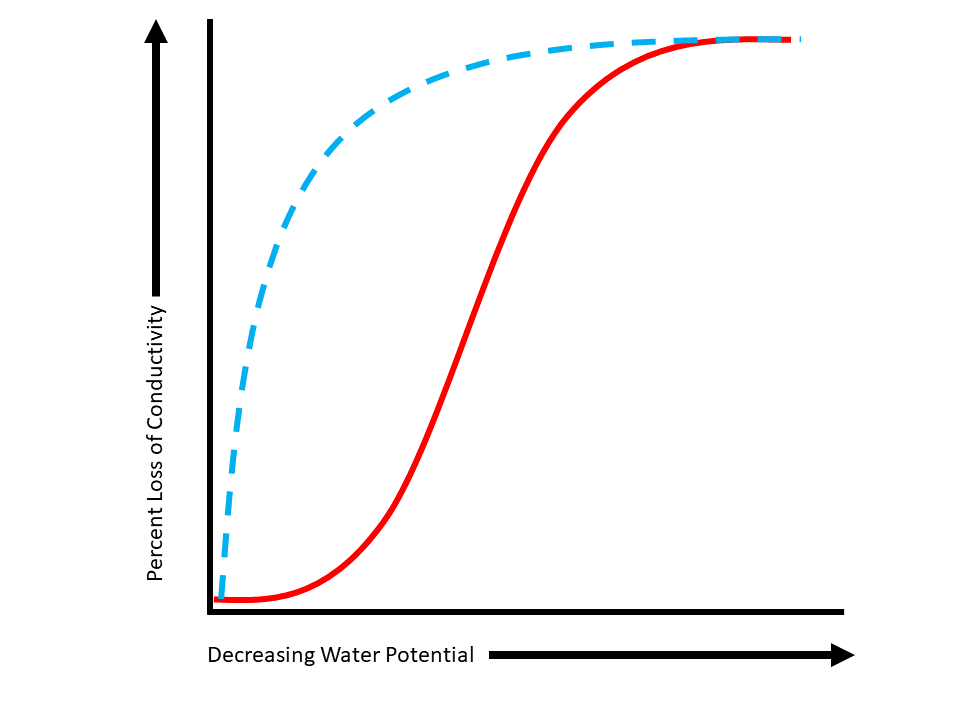

<!-- limit numbering depth for table of contents in chunk below -->
```{r, results='asis', echo = F}
toc_depth <- 2
sel <- paste0("h",(toc_depth+1):10, collapse = " > span, ")
cat(paste0("<style>",
           sel, 
           " > .header-section-number { display: none; } </style>"))
```
<!-- ```{r setup, include=FALSE} -->
<!-- knitr::opts_chunk$set(echo = FALSE) -->
<!-- ``` -->

# Hydraulic Traits {.tabset}
Plant hydraulic traits in the xylem functional traits database are most often those derived from, or related to the vulnerability curve of a species. Vulnerability curves describe the increase in hydraulic impairment (or, decrease in conductivity) along an increasing tension gradient (more negative water potentials). Below is a figure of a vulnerability curve: 

## P50
#### the xylem tension at which 50% of the maximum hydraulic conductivity is lost
```{r fig.align='center',p50, echo=FALSE, fig.cap="A vulnerability curve with P50 circled.", out.width = '100%'}
knitr::include_graphics("www/p50.png")
```
## P12 
#### the xylem tension at which 12% of the maximum hydraulic conductivity is lost
```{r fig.align='center',p12, echo=FALSE, fig.cap="A vulnerability curve with P12 circled.", out.width = '100%'}

```

## P88
#### the xylem tension at which 88% of the maximum hydraulic conductivity is lost
```{r fig.align='center',p88, echo=FALSE, fig.cap="A vulnerability curve with P88 circled.", out.width = '100%'}
knitr::include_graphics("www/p88.png")
```
## Slope
#### Slope of vulnerability curve (% / MPa) = (88-50)/(P88-P50)
```{r fig.align='center',slope, echo=FALSE, fig.cap="A vulnerability curve with P50, P88 circled, and the equation for slope.", out.width = '100%'}

```
## Curve
#### E = exponential (blue), S = sigmoidal (red), O = other

```{r fig.align='center',twocurves, echo=FALSE, fig.cap="Figure 2: A sigmoidal vulnerability curve (red solid line, 'S') and an exponential vulnerability curve (blue dashed line, 'E').", out.width = '100%'}

```
## Equation
#### W = Weibull, P = polynomial,  PW = Pammenter Vander Willigen, L = linear
## P50 method
#### DH = dehydration, CE = centrifuge, CA = cavitron, AD = air-injection double end, AS = air-injection single end, AE = acoustic emissions
## Ks 
#### (kg m-1 MPa-1 s-1) stem specific conductivity = xylem conductivity per unit of cross-sectional sapwood area
#### (mg m-1 MPa-1 s-1) stem specific conductivity = xylem conductivity per unit of cross-sectional sapwood area
## KL 
#### (kg m-1 MPa-1 s-1) leaf specific conductivity = xylem conductivity per total area of leaves distal to the measured segment
## ψmin
#### ψp min predawn (MPa) Minimum predawn xylem pressure potential.
#### ψp min midday (MPa) Minimum midday xylem pressure potential.
## Huber value
#### ratio of conducting xylem area per supported leaf area
## Capacitance
#### Sapwood water storage capacity (kg m-3 MPa-1)
# Anatomy
Placeholder for anatomy traits.

## Anatomy trait 1
Placeholder for anatomy trait 1 info.

## Anatomy trait 2
Placeholder for anatomy trait 2 info.