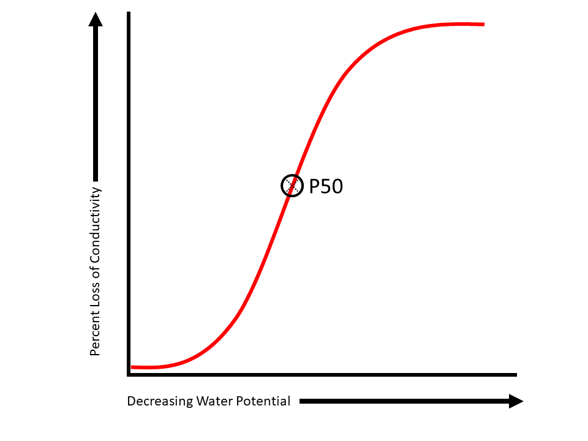

<!-- limit numbering depth for table of contents in chunk below -->
```{r, results='asis', echo = F}
toc_depth <- 2
sel <- paste0("h",(toc_depth+1):10, collapse = " > span, ")
cat(paste0("<style>",
           sel, 
           " > .header-section-number { display: none; } </style>"))
```
<!-- ```{r setup, include=FALSE} -->
<!-- knitr::opts_chunk$set(echo = FALSE) -->
<!-- ``` -->

# Hydraulic Traits {.tabset}
Plant hydraulic traits in the xylem functional traits database are most often those derived from, or related to the vulnerability curve of a species. Vulnerability curves describe the increase in hydraulic impairment (or, decrease in conductivity) along an increasing tension gradient (more negative water potentials). Below is a figure of a vulnerability curve: 

## P50
#### the xylem tension at which 50% of the maximum hydraulic conductivity is lost
```{r fig.align='center',p50, echo=FALSE, fig.cap="A vulnerability curve with P50 circled.", out.width = '100%'}

```
## P12 
#### the xylem tension at which 12% of the maximum hydraulic conductivity is lost
```{r fig.align='center',p12, echo=FALSE, fig.cap="A vulnerability curve with P12 circled.", out.width = '100%'}
knitr::include_graphics("www/p12.png")
```

## P88
#### the xylem tension at which 88% of the maximum hydraulic conductivity is lost
```{r fig.align='center',p88, echo=FALSE, fig.cap="A vulnerability curve with P88 circled.", out.width = '100%'}

```
## Slope
#### Slope of vulnerability curve (% / MPa) = (88-50)/(P88-P50)
```{r fig.align='center',slope, echo=FALSE, fig.cap="A vulnerability curve with P50, P88 circled, and the equation for slope.", out.width = '100%'}
knitr::include_graphics("www/slope.png")
```
## Curve
#### E = exponential (blue), S = sigmoidal (red), O = other

```{r fig.align='center',twocurves, echo=FALSE, fig.cap="Figure 2: A sigmoidal vulnerability curve (red solid line, 'S') and an exponential vulnerability curve (blue dashed line, 'E').", out.width = '100%'}
knitr::include_graphics("www/vc_twotypes.png")
```
## Equation
#### W = Weibull, P = polynomial,  PW = Pammenter Vander Willigen, L = linear
## P50 method
#### DH = dehydration, CE = centrifuge, CA = cavitron, AD = air-injection double end, AS = air-injection single end, AE = acoustic emissions
## Ks 
#### (kg m-1 MPa-1 s-1) stem specific conductivity = xylem conductivity per unit of cross-sectional sapwood area
#### (mg m-1 MPa-1 s-1) stem specific conductivity = xylem conductivity per unit of cross-sectional sapwood area
## KL 
#### (kg m-1 MPa-1 s-1) leaf specific conductivity = xylem conductivity per total area of leaves distal to the measured segment
## ψmin
#### ψp min predawn (MPa) Minimum predawn xylem pressure potential.
#### ψp min midday (MPa) Minimum midday xylem pressure potential.
## Huber value
#### ratio of conducting xylem area per supported leaf area
## Capacitance
#### Sapwood water storage capacity (kg m-3 MPa-1)
# Anatomy {.tabset}
Placeholder for anatomy traits overview.

## Av. tracheid length (μm)
#### only for gymnosperms and vesselless angiosperms
## Av. vessel length (cm)
#### only for angiosperms
## Vessel length method
#### vessel length method (silicon injection; air-injection; other)
## Max vessel length
#### (cm)	only for angiosperms
## Av. conduit diameter
#### (μm)	mean tangential vessel diameter for angiosperms; tangential tracheid diameter for gymnosperms
## dh mean hydraulic diameter (μm)
#### dh mean hydraulic diameter (μm)
## Conduit density per mm2	
#### Number of vessels (angiosperms) or tracheids (gymnosperms) per mm
## Vessel grouping index
#### Total number of vessels in a minimum of 25 vessel groups divided by the number of groups counted
## Ac (Intervessel contact fraction)
#### Fraction of the vessel surface area contacting another vessel (%) = perimeter of intervessel wall divided by total vessel wall perimeter
## Pit membrane surface area
#### (µm2)	Average pit membrane surface area - earlywood only
## Interconduit pit size
#### (μm)	horizontal diameter of a bordered pit at the broadest point (= pit membrane diameter) - earlywood only
## Outer pit aperture diameter
#### (μm)	horizontal diameter of the (outer) pit aperture at the broadest point - earlywood only
## Aperture / Pit size
#### Outer pit aperture diameter / interconduit pit size
## Intervessel pit membrane thickness
#### (nm)	intervessel pit membrane thickness
## Torus diameter
#### (μm)	horizontal diameter of the torus at its broadest point
## Torus overlap
#### (diameter of the torus - diameter of the aperture)/diameter of the torus
## Vestures
#### presence of small protuberances from the secondary cell wall associated with bordered pits of angiosperms
## Fp (pit fraction)
#### The fraction of the conduit wall occupied by interconduit pits, i.e. pit area per total conduit wall area
## Ap (interconduit pit (membrane) area mm2)
#### total interconduit pit (membrane) surface area [Ap = Fp x Avessel/tracheid]
## Porosity
#### diffuse-porosity; ring-porosity; semi-ring-porosity
## Perforation plates
#### Simple; scalariform; mixed (i.e. simple and scalariform)
## Ground tissue
#### tracheids (vasicentric, vascular or true tracheids), libriform fibres, fibres
## Vasicentric tracheids
#### tracheids surrounding vessels (present or absent)

# Mechanical Properties {.tabset}
Placeholder for mechanical properties overview.

## Modulus of rupture (MOR)
#### Modulus of rupture (MOR)
## Flexual stiffness (EI)
#### Flexual stiffness (EI)
## Modulus of elasticity (MOE)
#### Modulus of elasticity (MOE)
## t (μm)
#### double intervessel or intertracheid cell wall thickness (µm)
## Theoretical vessel implosion resistance
#### (t/b)2; t = double intervessel or intertracheid cell wall thickness (µm); b = vessel or tracheid lumen diameter (excluding the cell wall)
## ρ (wood specific gravity; g/cm3)
#### oven dry mass/fresh volume [please make a note in the notes column when green mass/volume was measured]

# Leaf data {.tabset}
Placeholder for leaf data overview.

## SLA (specific leaf area; cm2 g-1)	
#### specific leaf area = leaf area to mass ratio
## Total stomata density
#### sum of adaxial and abaxial stomatal densities (number of stomata per cm2)
## Stomatal index
#### [S / (E+S)] * 100, where S is the number of stomata per unit area, and E is the number of epidermal cells per same unit area
## Gs (mol m-2 s-1)
#### Maximum stomatal conductance
## Gsmin (mol m-2 s-1)
#### Minimum stomatal conductance
## Gcut (mol m-2 s-1)
#### Cuticular conductance
## Phenology
#### E = evergreen, W = winter deciduous, D = drought deciduous
## Amax (micromol/m2/s)
#### Photosynthetic capacity (micronol/m2/s)
## D13C
#### big delta 13C (per mill) for leaves

# Location {.tabset}
Placeholder for location overview.

## Location
#### City, area, location
## Country
#### Country
## Latitude
#### Latitude
## Longitude
#### Longitude
## Provenance Latitude
#### Provenance Latitude
## Provenance Longitude
#### Provenance Longitude
## Altitude
#### Altitude (m)
## Altitude provenance
#### Altitude provenance (m)
# Climate {.tabset}
Placeholder for climate overview.

## Mean annual precipitation
#### (mm)	for study area or GBIF queries for species names		
## Av annual temperature 
#### (C°)	for study area or GBIF queries for species names		
## Evapotranspiration
#### Evapotranspiration		
## Biome
#### TRR = tropical rainforest, TRS = tropical seasonal forest (savanna), TMR = temperate rain forest, TMS = temperate seasonal forest, WDS = woodland/shrubland, DES = deserts, BOT = boreal-tundra		
# Database {.tabset}
Placeholder for database overview.

## Reference 
#### Reference from which data was contributed.
## Contributor I 
#### Name of the participant who integrated the data
## Contributor II 
#### Name of the participant who double-checked the data.
## Notes
#### Any remark made by participants regarding the data.