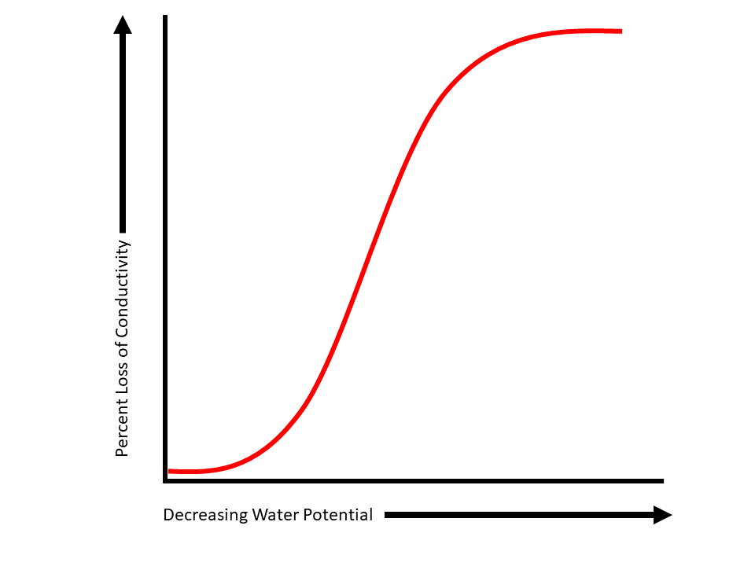

```{r setup, include=FALSE}
knitr::opts_chunk$set(echo = FALSE)
```


# Hydraulic Traits
Plant hydraulic traits in the xylem functional traits database are most often those derived from, or related to the vulnerability curve of a species. Vulnerability curves describe the increase in hydraulic impairment (or, decrease in conductivity) along an increasing tension gradient (more negative water potentials). Below is a figure of a vulnerability curve: 

```{r fig.align='center',onecurve, echo=FALSE, fig.cap="Figure 1: A vulnerability curve.", out.width = '80%'}

```

## P50 (MPa)
#### the xylem tension at which 50% of the maximum hydraulic conductivity is lost
## P12 
#### the xylem tension at which 12% of the maximum hydraulic conductivity is lost
## P88 (MPa)
#### the xylem tension at which 88% of the maximum hydraulic conductivity is lost
## Slope
#### Slope of vulnerability curve (% / MPa) = (88-50)/(P88-P50)
## Curve
#### E = exponential, S = sigmoidal, O = other

```{r fig.align='center',twocurves, echo=FALSE, fig.cap="Figure 2: An s-shaped vulnerability curve (red solid line) and an r-shaped vulnerability curve (blue dashed line).", out.width = '80%'}
knitr::include_graphics("www/vc_twotypes.png")
```
## Equation
#### W = Weibull, P = polynomial,  PW = Pammenter Vander Willigen, L = linear
## P50 method
#### DH = dehydration, CE = centrifuge, CA = cavitron, AD = air-injection double end, AS = air-injection single end, AE = acoustic emissions
## Ks (kg m-1 MPa-1 s-1)
#### stem specific conductivity = xylem conductivity per unit of cross-sectional sapwood area
## Ks (mg m-1 MPa-1 s-1)
#### stem specific conductivity = xylem conductivity per unit of cross-sectional sapwood area
## KL (kg m-1 MPa-1 s-1)
#### leaf specific conductivity = xylem conductivity per total area of leaves distal to the measured segment
## ψp min predawn (MPa)
#### Minimum predawn xylem pressure potential
## ψp min midday (MPa)
#### Minimum midday xylem pressure potential
## Huber value
#### ratio of conducting xylem area per supported leaf area
## Sapwood capacitance  (kg m-3 MPa-1)
#### Sapwood water storage capacity (kg m-3 MPa-1)